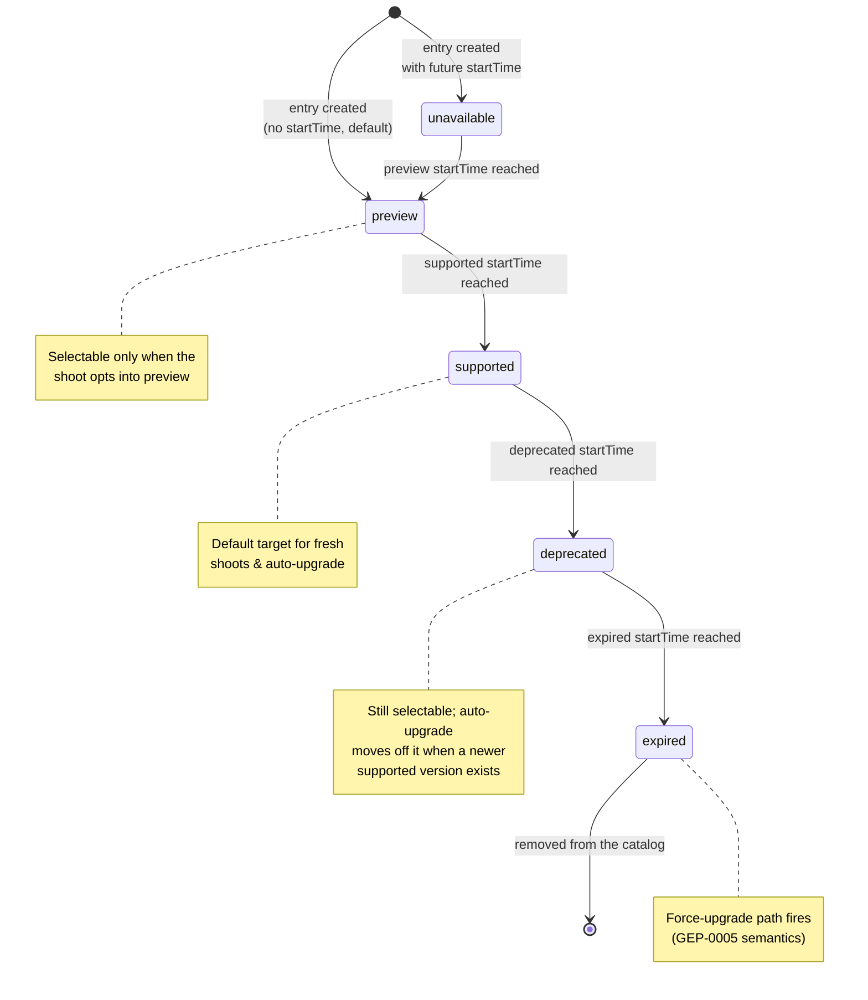
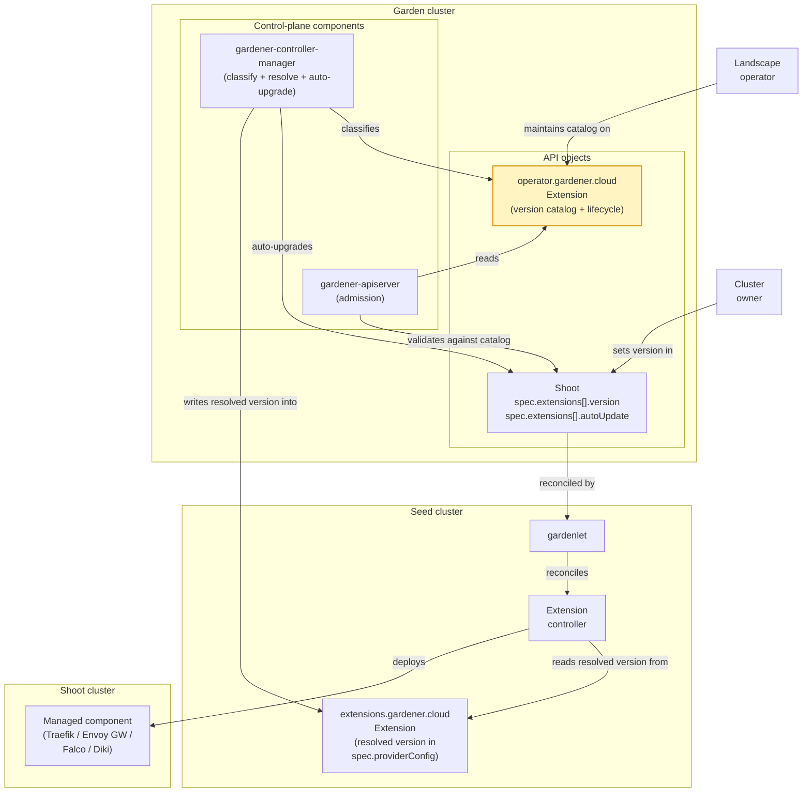
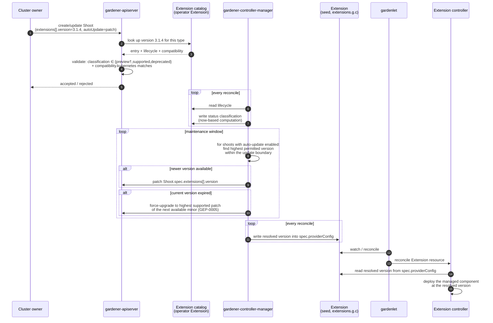

# GEP-78: Homogeneous Version Catalog for Extension-Managed Components

## Summary

This GEP proposes a **homogeneous version catalog for extension-managed
components**, reusing the version-lifecycle model Gardener already applies to
Kubernetes and machine-image versions in `CloudProfile` (the classification
lifecycle formalised in [GEP-0032], the force-upgrade semantics in
[GEP-0005]). The unit of versioning is the *component* the extension installs
— **not** the extension controller binary, whose version is an operator
concern and is not visible to shoot owners.

The landscape operator lists the offered component versions — with a
`preview → supported → deprecated → expired` lifecycle — **on the operator
`Extension` resource** (`operator.gardener.cloud/v1alpha1`) it already uses to
register the extension, rather than in a new standalone CRD. Cluster owners
**pin** a component version through the shoot's `spec.extensions[]` surface and
may **opt in to auto-upgrade** within a patch, minor, or major boundary — the
same UX they already know from `spec.kubernetes.version`.

`gardener-controller-manager` classifies the catalog, drives auto-upgrade and
force-upgrade, and **resolves the effective version into the seed-side
`Extension` resource** (`extensions.gardener.cloud/v1alpha1`); the extension
controller simply reads it from `spec.providerConfig`. No new shared library is
required, and extensions never need garden-cluster access.

[GEP-0005]: ../0005-versioning-policy/README.md
[GEP-0032]: ../0032-version-classification-lifecycle/README.md
[GEP-0057]: ../0057-replace-nginx-ingress-shoot-addon-with-traefik-extension/README.md
[GEP-0063]: ../0063-diki-extension/README.md
[GEP-0068]: ../0068-gateway-api-extension/README.md
[gardener-extension-falco]: https://github.com/gardener/gardener-extension-shoot-falco-service

## Motivation

A growing set of Gardener extensions manage a component whose version their
users legitimately care about — the ingress controller behind Traefik, the
gateway behind Envoy Gateway, the runtime-security agent behind Falco, the
scanner behind Diki, and the gVisor runtime behind the (planned) gVisor
extension. Their value proposition *explicitly* includes giving the cluster
owner control over the version of the installed component: rather than tying
that version to whatever the extension release happens to ship, these
extensions aim to let users schedule component updates themselves — always
within the boundaries (supported versions, deprecation windows, expiry dates)
that the landscape operator defines. This is the same freedom shoot owners
already have for their Kubernetes version, and the same guardrails.

The problem is that several extensions have arrived at this need
independently, and each has grown — or is about to grow — its own
version-management surface:

* The **Falco extension** ([`gardener-extension-shoot-falco-service`][gardener-extension-falco],
  type `shoot-falco-service`) ships a bespoke `FalcoProfile` CRD with its own
  classification scheme. It has, in effect, already solved this problem for
  itself.
* The **Traefik extension** ([GEP-0057], type `shoot-traefik`) pins one
  component version per extension release.
* The **Diki extension** ([GEP-0063], type `diki`) surfaces a `dikiVersion`
  plus a list of rulesets with their own versions inside the `ComplianceScan`
  CRD.
* The **Envoy Gateway extension** ([GEP-0068], type `envoy-gateway`) lands with
  its own version matrix.

The concern is not that any one of these approaches is wrong — Falco's
demonstrates that a per-extension profile can work. The concern is that every
extension is left to invent its own, so that:

* every new extension in this family re-invents versioning — cost paid N times,
* operators cannot build a single dashboard to reason about
  extension-managed-component version coverage across a landscape,
* cluster owners cannot script consistent policies ("stay on the latest
  supported minor, opt out of previews") across these extensions.

Gardener already solved these questions once, consistently, for Kubernetes and
machine-image versions in `CloudProfile`. This GEP reuses that proven model for
the subset of extensions where user-facing component versioning is part of the
product.

**Relationship to `CloudProfile`, [GEP-0032] and [GEP-0005].** The lifecycle
vocabulary and classification semantics this GEP builds on are those
*implemented today* in `CloudProfile` for Kubernetes and machine-image
versions. [GEP-0032] formalises the classification lifecycle; [GEP-0005]
defines the versioning policy, including the force-upgrade behaviour on expiry.
Where the two diverge from the existing implementation, the existing
implementation is the reference for this GEP.

### Goals

1. Provide **one** version-catalog model for extensions that explicitly expose
   a managed-component version to cluster owners (currently: the Falco,
   Traefik, Diki, Envoy Gateway and planned gVisor extensions).
2. Version the *managed component(s)*, not the extension controller binary. The
   binary version is an operator concern owned by the deployment surfaces
   (`ControllerDeployment` / operator `Extension`) and is out of scope here.
3. Support extensions that manage **more than one** component: each catalog
   entry is a named component version, so a single extension type can offer
   several independently-versioned components.
4. Reuse the lifecycle classifications and status-computation semantics that
   `CloudProfile` implements today ([GEP-0032]) — verbatim, with no parallel
   vocabulary.
5. Give cluster owners an explicit **pin** surface plus a documented
   **auto-upgrade** opt-in, and preserve **force-upgrade** on expiry —
   targeting the *highest* supported patch of the next available minor, exactly
   as [GEP-0005] specifies for Kubernetes versions.
6. Resolve the pinned version to the extension through the **existing seed
   `Extension` contract**, so extensions read the resolved version from
   `spec.providerConfig` and need no new library or garden-cluster access.

### Non-Goals

1. Forcing *all* extensions onto this model. Extensions that do not expose a
   component version to users are out of scope. However, any extension that
   *does* want to offer user-facing component-version control **should** adopt
   this model rather than invent its own — a per-extension bespoke profile is
   [rejected in principle](#per-extension-bespoke-profile-the-falcoprofile-pattern)
   as the idiomatic approach (third-party extensions in the wild cannot be
   strictly enforced, but this is the recommended path).
2. Redefining the lifecycle vocabulary that `CloudProfile` / [GEP-0032]
   establish.
3. Prescribing which component versions any specific extension must ship. This
   GEP defines the *mechanism*; the concrete catalog content is authored by the
   landscape operator.
4. Replacing `ControllerRegistration`, `ControllerDeployment` or the operator
   `Extension` resource. This GEP adds *alongside* them (it extends the operator
   `Extension`).
5. Versioning the extension controller *binary*. Operators roll a matching
   catalog and controller binary together.
6. Versioning components in runtime clusters (`garden` / `seed`). Scope is
   *shoot-facing* components only; a follow-up may extend the model.
7. Per-worker-pool component versions (e.g. a distinct GPU-driver version per
   pool). No concrete requirement exists yet; the named-entry structure does
   not preclude adding a pool selector later.
8. Cross-component dependency resolution ("Envoy Gateway X requires
   cert-manager ≥ Y"). Left to a future GEP.

## Proposal

### Scope of participating extensions

The target set is the extensions listed in [Motivation](#motivation):
`shoot-falco-service`, `shoot-traefik`, `diki`, `envoy-gateway`, and the
planned gVisor extension. Other extensions — CNI, cloud-provider, OS
extensions, and similar — remain unchanged; they already have a versioning
story that fits their nature and this GEP has no ambition to touch them.

### The version catalog lives on the operator `Extension` resource

The **landscape operator** already registers each extension through an operator
`Extension` resource (`operator.gardener.cloud/v1alpha1`) in the garden runtime
cluster. This GEP adds the component-version catalog to that same resource,
rather than introducing a separate CRD:

* it keeps the catalog next to the deployment surface the operator already
  edits when rolling a new extension version, so the catalog and a matching
  controller binary are updated together;
* it avoids a second top-level resource and the need to reconcile a separate
  object's identity with the extension type;
* the operator is the actor who knows which component versions the landscape
  should offer and on what schedule — the extension controller does not carry
  that policy.

```yaml
apiVersion: operator.gardener.cloud/v1alpha1
kind: Extension
metadata:
  name: extension-shoot-traefik
spec:
  # ... existing deployment/resources fields ...

  # NEW: the component-version catalog for this extension.
  componentVersions:
    # The auto-update policy applied to shoots of this type that do not set an
    # explicit spec.extensions[].autoUpdate. Optional; defaults to `patch`.
    defaultUpdateStrategy: patch          # patch | minor | major | none
    # Which spec.extensions[].autoUpdate strategies this extension implements;
    # admission rejects any shoot (or default) requesting a strategy not listed.
    supportedUpdateStrategies: [patch, minor, major, none]
    versions:
      - # A named component version moving through the lifecycle. The `name`
        # lets one extension offer several components; single-component
        # extensions use one stable name (e.g. the component's own name).
        name: traefik
        version: "3.1.4"
        # Compatibility envelope, evaluated on admission.
        compatibility:
          kubernetes:
            minimum: "1.28"
            maximum: "1.32"
        # Identical shape to CloudProfile version lifecycles ([GEP-0032]).
        lifecycle:
          - classification: preview
          - classification: supported
            startTime: "2026-07-15T00:00:00Z"
          - classification: deprecated
            startTime: "2026-11-01T00:00:00Z"
          - classification: expired
            startTime: "2026-12-15T00:00:00Z"

      - name: traefik
        version: "3.2.0"
        compatibility:
          kubernetes:
            minimum: "1.30"
        lifecycle:
          - classification: preview
            startTime: "2026-08-01T00:00:00Z"

status:
  # Computed by gardener-controller-manager on every reconcile — the same
  # algorithm that produces CloudProfile version classifications.
  componentVersions:
    - name: traefik
      version: "3.1.4"
      classification: supported
    - name: traefik
      version: "3.2.0"
      classification: unavailable        # startTime is in the future
```

Each entry is a single `(name, version)` pair carrying its own `lifecycle` and
`compatibility`; it is promoted, deprecated and expired as a unit. The
`updateStrategy` vocabulary (`patch | minor | major`, plus `none`) is aligned
with the `CloudProfile` machine-image `updateStrategy` field.

Deliberately absent:

* No `controllerVersion` gate. Operators roll the catalog and controller binary
  as one unit; a per-entry gate would give a false sense of safety.
* No `dependencies` bundle. The extension controller already knows which
  auxiliary images and charts correspond to a resolved version; encoding that
  here duplicates state.

#### Optional per-version `providerConfig`

Each catalog entry MAY carry an **optional `providerConfig`** — a
`RawExtension` whose shape is owned by the extension. The core fields
(`name`, `version`, `lifecycle`, `compatibility`, `classification`) stay
homogeneous for everyone; `providerConfig` is the escape hatch for
extension-specific metadata a version needs. `gardener-apiserver` treats it
opaquely; `gardener-controller-manager` copies the resolved entry's
`providerConfig` down to the seed `Extension`, where the extension controller
decodes it.

Because it is optional and per-version, an extension that needs none of it (for
example Traefik) simply omits it, and the entry stays a pure `version` +
`lifecycle` bundle.

A typical use is declaring the sub-component versions a top-level version
supports. Some managed components carry sub-components with their own versions
— Diki is the clearest example, pairing a `dikiVersion` with a list of
independently-versioned `rulesets` ([GEP-0063]). This GEP versions the
top-level component; finer-grained sub-component versions stay inside the
extension's own CRDs (`ComplianceScan.spec.rulesets[]` in Diki's case), and the
per-version `providerConfig` declares which sub-component versions the entry is
compatible with:

```yaml
versions:
  - name: diki
    version: "0.24.0"
    lifecycle:
      - classification: supported
        startTime: "2026-07-01T00:00:00Z"
    # Optional, opaque to gardener-apiserver, decoded by the Diki extension.
    providerConfig:
      apiVersion: diki.extensions.gardener.cloud/v1alpha1
      kind: DikiVersionConfig
      supportedRulesetVersions:
        - "v0.23"
        - "v0.24"
```

A fully nested catalog (independent lifecycles per sub-component) is possible
but out of scope for this iteration; the named-entry structure does not
preclude it.

### How a cluster owner pins a version

Cluster owners select a component version on `Shoot.spec.extensions[]` — the
same core `Extension` entry (`type` / `providerConfig` / `disabled`) they use
today, extended with a `version` and an `autoUpdate` block. Same mental model
as `spec.kubernetes.version`:

```yaml
apiVersion: core.gardener.cloud/v1beta1
kind: Shoot
spec:
  extensions:
    - type: shoot-traefik
      version: "3.1.4"               # pin (optional)
      autoUpdate:
        enabled: true
        updateStrategy: patch        # patch | minor | major | none
      providerConfig:
        apiVersion: traefik.extensions.gardener.cloud/v1alpha1
        kind: TraefikConfig
        # ...
```

These fields live on the shoot's core API (not inside `providerConfig`) on
purpose: the owner-visible knob for a *homogeneous* mechanism must be
discoverable without opening each extension's provider-config schema, and
admission validation against the catalog needs stable typed fields, not a
`RawExtension`.

* `autoUpdate.updateStrategy: patch` auto-upgrades to newer supported *patch*
  releases within the pinned minor (`3.1.4 → 3.1.7`).
* `minor` auto-upgrades to newer supported *minor* releases within the pinned
  major (`3.1.4 → 3.2.0`), patches included.
* `major` always tracks the newest supported version the catalog offers,
  crossing major boundaries — the "keep me current" option.
* `none` (or `autoUpdate.enabled: false`) freezes on the pinned version until it
  hits `expired`, at which point the force-upgrade path fires (see
  [Design Details](#admission-and-reconciliation)).

The `autoUpdate` block is deliberately extensible. A future iteration can add a
`classifications` list to opt auto-upgrade into `preview` versions (mirroring
[gardener/gardener#13667](https://github.com/gardener/gardener/issues/13667))
without a schema break:

```yaml
autoUpdate:
  enabled: true
  updateStrategy: patch
  classifications: [supported]     # future: e.g. [preview, supported]
```

**`version` is optional, and this is the adoption story.** If a shoot sets no
`version` for an extension — the only supported semantic — the extension
behaves exactly as it does today: the catalog is not consulted and nothing
changes. Setting `version` is only valid for an extension type whose operator
`Extension` publishes a `componentVersions` catalog; admission rejects a
`version` for a type with no catalog. An extension therefore starts
participating once (a) the operator publishes a catalog and (b) shoots begin
setting `version` — no coordinated flag day, no broken existing shoots.
Extensions that surface a component version inside their provider-config today
(Diki's `dikiVersion`, Falco's `FalcoProfile` selection) move the canonical pin
to `Shoot.spec.extensions[].version` and deprecate the legacy field on their
own timeline.

**Partial versions.** As with Kubernetes and machine-image versions, a shoot
may pin a partial version (e.g. `3.1`); `gardener-apiserver` resolves it to the
highest matching supported version at admission and persists the resolved
value into the spec. Persisting at admission (rather than resolving live on
every reconcile) keeps behaviour explicit and auditable: a later catalog change
never silently moves a shoot; the auto-upgrade loop is the only thing that
mutates a pinned version, and it emits an event when it does.

**Default policy.** If a shoot omits `autoUpdate`, the effective default is
*not* `none`: leaving shoots frozen by default silently accumulates components
that will eventually force-upgrade. The default is the operator-configurable
`componentVersions.defaultUpdateStrategy`; an extension whose operator sets no
explicit default inherits `patch` — the least-surprising automatic policy,
keeping shoots current on security and bug-fix releases within their pinned
minor. An operator that wants a different posture sets it on the catalog.

### Constraints and caveats

* The catalog is limited to components that publish enumerable versioned
  releases. A component that is not meaningfully versioned does not need a
  catalog.
* **Version-string format.** Semver is preferred because it is what the
  [GEP-0032] classifier expects. Components publishing non-semver versions MUST
  be wrapped in a semver-compatible facade at catalog level, exactly as
  GardenLinux already does for OS versions — for example Diki's `v0.24` becomes
  `0.24.0`, and a calendar tag like `2026.03` becomes `2026.3.0`. A total order
  is a hard requirement of the auto-upgrade logic; nothing works without one.
* As with Kubernetes and machine-image versions, listing a version whose image
  the operator has not yet published in the image vector produces an
  unpullable component — the operator's responsibility to keep catalog and
  artifacts in sync, not specific to this GEP.

### Risks and Mitigations

| Risk                                                                       | Likelihood | Impact | Mitigation                                                                                                                     |
| ---                                                                        | ---        | ---    | ---                                                                                                                            |
| Participating extensions adopt the catalog inconsistently                  | Medium     | High   | The shape is homogeneous and enforced by `gardener-apiserver` admission; extensions consume the resolved version identically from the seed `Extension`. |
| Force-upgrades break stateful components (Falco rulesets, Traefik CRDs)    | Low        | High   | Per-version compatibility metadata; operator-configurable grace window before expiry.                                          |
| Non-semver versions produce surprising auto-upgrade orderings              | Medium     | Medium | Semver facade required; ordering documented per extension.                                                                     |
| Auto-upgrade surprises cluster owners                                      | Medium     | Medium | Default policy is the conservative `patch` (operator-tunable); every upgrade emits a `Shoot` event with source and target version, and stays within the pinned minor unless the owner opts into `minor`/`major`. |

## Design Details

### The version-lifecycle state machine

Identical to [GEP-0032], reproduced here for reference:



### Actors, resources and control loops



The end-to-end flow:



**Concretely responsible components:**

1. **Admission — `gardener-apiserver`**
   * `Shoot.spec.extensions[].version` must exist in the referenced
     extension's `componentVersions` catalog; setting a `version` for a type
     with no catalog is rejected.
   * The selected version must be classified `supported` or `deprecated`, or
     `preview` **when the shoot opts into preview** (via
     `autoUpdate.classifications` in a future iteration, or an explicit
     preview acknowledgement). `unavailable` and `expired` are rejected — the
     only difference between the classifications at admission is whether the
     version is selectable at all.
   * `compatibility.kubernetes` must satisfy the shoot's Kubernetes version.
   * A partial `version` is resolved to the highest matching supported version
     and persisted.
   * If `autoUpdate` is unset, `updateStrategy` is defaulted to the catalog's
     `defaultUpdateStrategy`, and if that too is unset, to `patch`. A strategy
     not listed in `supportedUpdateStrategies` is rejected — including as the
     resolved default, so an operator cannot default to a strategy the
     extension does not implement.

2. **Classification, auto-upgrade and resolution — `gardener-controller-manager`**
   * Compute the catalog `status` classification from `lifecycle` and current
     time — reusing the [GEP-0032] implementation.
   * For each shoot with auto-update enabled, evaluate whether a newer permitted
     version exists within the strategy's boundary (`patch` → same minor,
     `minor` → same major, `major` → any); if so, patch
     `spec.extensions[].version` during the next maintenance window and emit a
     `Shoot` event.
   * On `expired`, apply the force-upgrade path (below).
   * **Resolve** the effective `(name, version)` and its `providerConfig`, and
     write them into the seed-side `Extension` resource's `spec.providerConfig`
     (see component 4). This single mechanism serves every extension —
     including Diki — so no extension re-implements update strategies.

3. **Force-upgrade path — `gardener-controller-manager`**
   * When a shoot's pinned version transitions to `expired`, the
     controller-manager patches `spec.extensions[].version` to the **highest
     supported patch of the current minor**, or — if none remains — to the
     **highest supported patch of the next available minor**, exactly as
     [GEP-0005] specifies for Kubernetes versions. It never targets an
     unsupported version. This is the special case of the auto-upgrade loop
     that also applies to shoots with `updateStrategy: none`.

4. **Deployment — `gardenlet` and extension controller**
   * `gardener-controller-manager` has already written the resolved version
     (and the entry's optional `providerConfig`) into the seed-side `Extension`
     resource (`extensions.gardener.cloud/v1alpha1`), the existing
     gardenlet↔controller contract.
   * `gardenlet` reconciles the `Extension` resource as it does today. The
     extension controller reads the resolved version from
     `spec.providerConfig` and deploys the managed component at that version.
     Everything auxiliary (charts, images, sidecars) remains its internal
     concern.

This answers the two questions the design must not leave open: *who resolves*
(gardener-controller-manager) and *how the resolved version reaches the
extension* (the existing seed `Extension` `providerConfig`, no new library and
no garden-cluster access from extensions).

### Diki — same loop, replicated into `ComplianceScan`

Diki fits this model without an exemption. `gardener-controller-manager`
classifies the Diki catalog and resolves the effective `diki` version into the
seed-side `Extension` resource, exactly as for every other extension. The Diki
extension — whose operator runs in the shoot's namespace on the seed
([GEP-0063]) — reads the resolved version from `spec.providerConfig` and
**replicates it into the `ComplianceScan` objects** it manages
(`spec.dikiVersion`), and validates the ruleset selection against the entry's
`supportedRulesetVersions`. Diki does not need to re-implement Gardener's
update strategies; it inherits them from the controller-manager loop and only
propagates the already-resolved value into its CRs.

```yaml
apiVersion: operator.gardener.cloud/v1alpha1
kind: Extension
metadata:
  name: extension-diki
spec:
  componentVersions:
    versions:
      - name: diki
        version: "0.24.0"
        lifecycle:
          - classification: supported
            startTime: "2026-07-01T00:00:00Z"
        providerConfig:
          apiVersion: diki.extensions.gardener.cloud/v1alpha1
          kind: DikiVersionConfig
          supportedRulesetVersions:
            - "v0.23"
            - "v0.24"
```

Which Diki versions are *offered* to owners is derived from the catalog
`status` classifications (a client such as the dashboard shows the selectable
ones); which version a shoot *runs* is the pinned/auto-upgraded value that
gardener-controller-manager resolves. (The exact CR-replication mechanics on
the Diki side are for the Diki maintainers to confirm.)

### Rollout and feature gating

The implementation spans a core API addition (`Shoot.spec.extensions[].version`
+ `autoUpdate`), an operator `Extension` API addition (`componentVersions`), a
`gardener-apiserver` admission plugin (under `plugin/pkg`, per Gardener's layout
conventions), and new `gardener-controller-manager` loops — clearly several PRs
across releases. To keep partially-merged pieces from shipping enabled in
intermediate releases, the whole surface is guarded by a feature gate
(`ExtensionComponentVersions`), disabled by default until the classify /
auto-upgrade / resolve loops and admission are all present, mirroring the
incremental-rollout approach in [GEP-0057] and [GEP-0068]. Promotion out of the
feature gate is tracked as a Future Enhancement.

## Drawbacks

* Every participating extension maintainer must adopt the catalog — most acute
  for Falco, which retires an existing `FalcoProfile` surface with real users.
* Extends the operator `Extension` API with a versioning surface, adding
  cognitive load — softened by mirroring the `CloudProfile` lifecycle the
  operator already knows.
* Auto-upgrade adds a failure mode: a component upgrade may destabilise a shoot
  outside an owner-initiated action. Confining the default to `patch`, emitting
  an event per upgrade, and letting operators choose a more conservative default
  (down to `none`) soften but cannot eliminate this.

## Alternatives

### Standalone `ExtensionProfile` CRD

Considered and rejected in favour of extending the operator `Extension`
resource. A separate CloudProfile-style CRD is conceptually clean, but it adds a
second top-level resource whose identity must be kept in sync with the extension
type and which the operator edits separately from the deployment surface.
Placing the catalog on the operator `Extension` keeps a single object per
extension and one place to update when rolling a new version. If a future need
for an independent lifecycle emerges, the catalog can be split out without
changing the shoot-facing surface.

### Extend `CloudProfile` with an `extensions` section

Rejected. A `CloudProfile` is *specific to one infrastructure*, whereas the
extensions in scope are largely *infrastructure-independent*: their component
versions do not vary by cloud provider, so pinning them inside per-provider
`CloudProfile`s would duplicate the same matrix across every profile in a
landscape. `CloudProfile` is also already unwieldy and politically expensive to
change.

### Version only the extension binary

Rejected. This is the current Traefik model and the problem this GEP solves: it
ties the component version to the extension release cadence, so owners cannot
schedule component updates independently.

### Per-extension bespoke profile (the `FalcoProfile` pattern)

**Rejected in principle.** Falco's `FalcoProfile` demonstrates the pattern can
work, but if the community invests in a harmonised solution, that solution
should be the idiomatic approach for extensions with such version requirements.
We cannot strictly enforce this for third-party extensions in the wild, but
inventing a new per-extension profile CRD is discouraged in favour of the
homogeneous catalog defined here.

### Release channels (GKE-style `rapid` / `regular` / `stable`)

Considered, deferred. A channel is defined as "the highest supported version in
tier X"; you need the classified-version primitive first, which this GEP
delivers. `autoUpdate.updateStrategy: minor` already covers a large fraction of
the channel value proposition. Channels remain a natural follow-up: a future
`channel` field on `Shoot.spec.extensions[]` could resolve to a version via the
catalog without any change to the catalog shape.

### Two-level versioning (extension binary version × component catalog)

Deferred. Expressive but adds a second axis without a compelling near-term use
case. If a real coupling constraint appears, it can be added as a
`compatibility.controller` field without a schema break.
