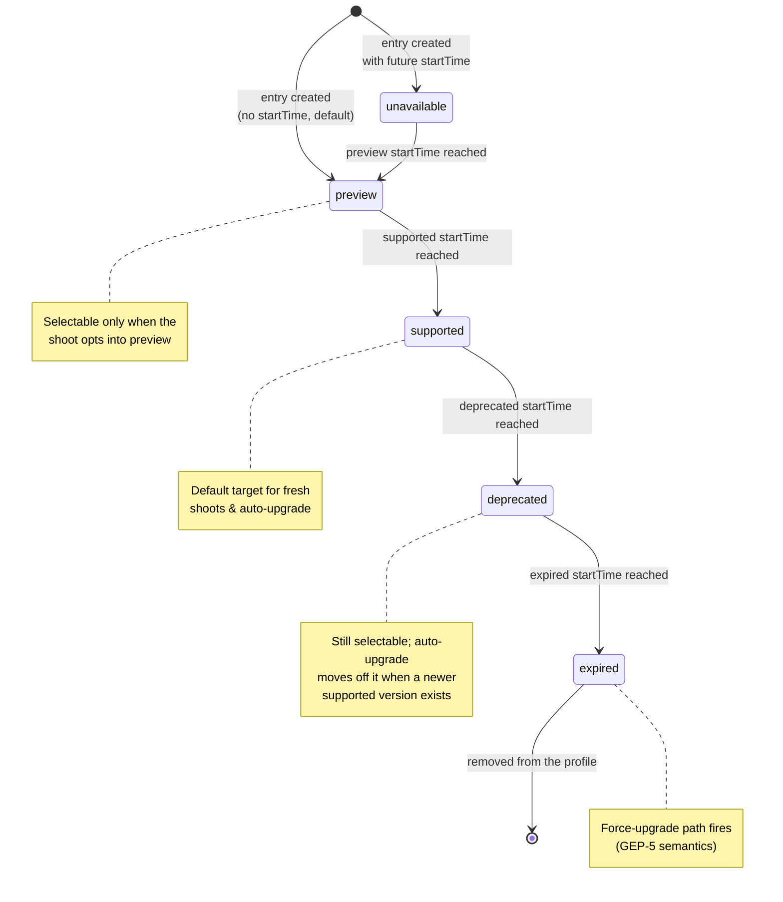
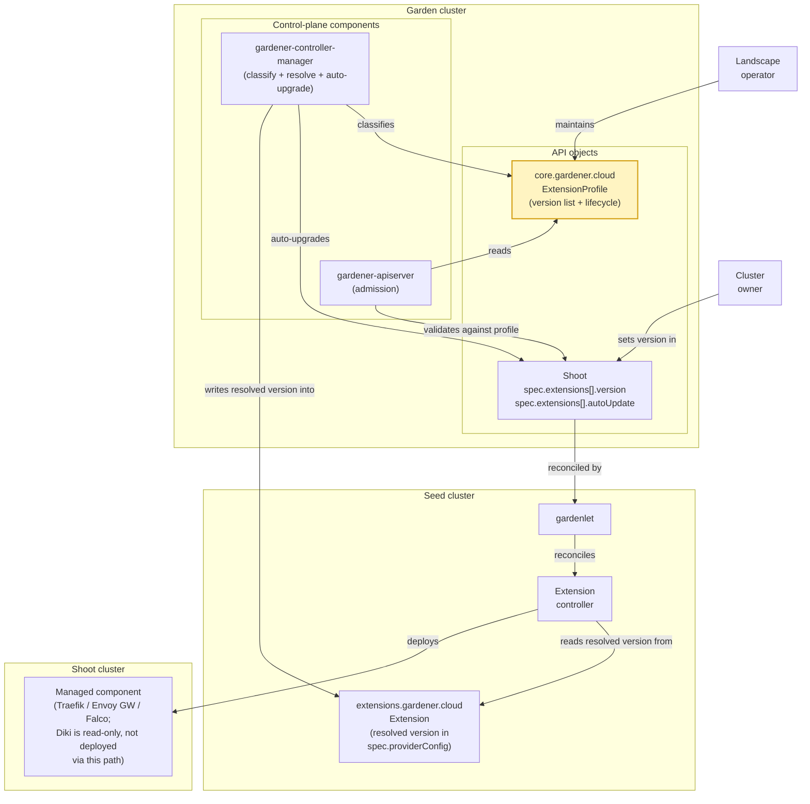
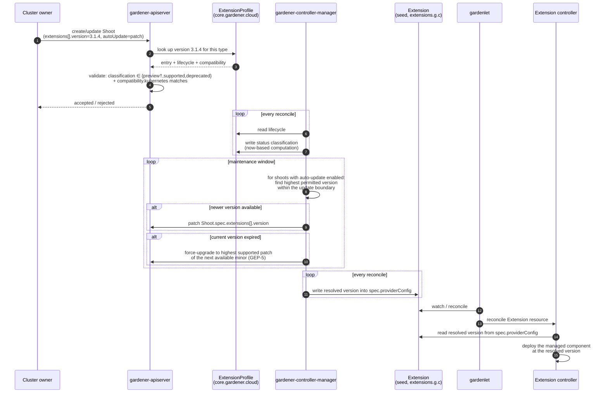

# GEP-78: Homogeneous Version Profile for Extension-Managed Components

## Summary

This GEP proposes a **homogeneous version profile for extension-managed
components**, reusing the version-lifecycle model Gardener already applies to
Kubernetes and machine-image versions in `CloudProfile` (the classification
lifecycle formalised in [GEP-32], the force-upgrade semantics in
[GEP-5]). The unit of versioning is the *component* the extension installs
— **not** the extension controller binary, whose version is an operator
concern and is not visible to shoot owners.

The landscape operator lists the offered component versions — with a
`preview → supported → deprecated → expired` lifecycle — in a dedicated
**`ExtensionProfile`** resource, one per participating extension type,
side-by-side with (not inlined into) the `Extension` resource that registers
the extension. This keeps the version list on its own `CloudProfile`-style
object rather than overloading the extension-registration surface. Cluster
owners **pin** a component version through the shoot's `spec.extensions[]`
surface and may **opt in to auto-upgrade** within a patch, minor, or major
boundary — the same UX they already know from `spec.kubernetes.version`.

`gardener-controller-manager` classifies the profile, drives auto-upgrade and
force-upgrade, and **resolves the effective version into the seed-side
`Extension` resource** (`extensions.gardener.cloud/v1alpha1`); the extension
controller simply reads it from `spec.providerConfig`. No new shared library is
required, and extensions never need garden-cluster access.

[GEP-5]: ../0005-versioning-policy/README.md
[GEP-32]: ../0032-version-classification-lifecycle/README.md
[GEP-57]: ../0057-replace-nginx-ingress-shoot-addon-with-traefik-extension/README.md
[GEP-63]: ../0063-diki-extension/README.md
[GEP-68]: ../0068-gateway-api-extension/README.md
[gardener-extension-falco]: https://github.com/gardener/gardener-extension-shoot-falco-service

## Motivation

A growing set of Gardener extensions manage a component whose version their
users legitimately care about — the ingress controller behind Traefik, the
gateway behind Envoy Gateway, the runtime-security agent behind Falco, the
scanner behind Diki, and the gVisor runtime behind the (planned) gVisor
extension. Their value proposition *explicitly* includes giving the cluster
owner control over the version of the installed component: rather than tying
that version to whatever the extension release happens to ship, these
extensions aim to let users schedule component updates themselves — within the
supported-versions / deprecation-window / expiry-date boundaries the landscape
operator defines, i.e. the same freedom and guardrails shoot owners already
have for their Kubernetes version.

The problem is that several extensions have arrived at this need
independently, and each has grown — or is about to grow — its own
version-management surface:

* The **Falco extension** ([`gardener-extension-shoot-falco-service`][gardener-extension-falco],
  type `shoot-falco-service`) ships a bespoke `FalcoProfile` CRD with its own
  classification scheme. It has, in effect, already solved this problem for
  itself.
* The **Traefik extension** ([GEP-57], type `shoot-traefik`) pins one
  component version per extension release.
* The **Diki extension** ([GEP-63], type `diki`) surfaces a `dikiVersion`
  (the scanner) plus a list of independently-versioned rulesets, each with its
  own `id` and `version`, inside the `ComplianceScan` CRD. Unlike the extensions
  above, the available Diki versions are determined by the `diki-operator` and
  the `diki-extension` release rather than by an operator-curated list, so for
  Diki the `ExtensionProfile` is **read-only** (see
  [Diki](#diki--a-read-only-version-profile)).
* The **Envoy Gateway extension** ([GEP-68], type `envoy-gateway`) lands with
  its own version matrix.

The concern is not that any one of these approaches is wrong — Falco's
demonstrates that a per-extension profile can work. The concern is that every
extension is left to invent its own, so that:

* every new extension in this family re-invents versioning — cost paid N times,
* operators cannot build a single dashboard to reason about
  extension-managed-component version coverage across a landscape,
* cluster owners cannot script consistent policies ("stay on the latest
  supported minor, opt out of previews") across these extensions.

Gardener already solved these questions once, consistently, for Kubernetes and
machine-image versions in `CloudProfile`. This GEP reuses that proven model for
the subset of extensions where user-facing component versioning is part of the
product.

**Relationship to `CloudProfile`, [GEP-32] and [GEP-5].** The lifecycle
vocabulary and classification semantics this GEP builds on are those
*implemented today* in `CloudProfile` for Kubernetes and machine-image
versions. [GEP-32] formalises the classification lifecycle; [GEP-5]
defines the versioning policy, including the force-upgrade behaviour on expiry.
Where the two diverge from the existing implementation, the existing
implementation is the reference for this GEP.

### Goals

1. Provide **one** `ExtensionProfile` model for extensions that explicitly
   expose a managed-component version to cluster owners (the set enumerated in
   [Motivation](#motivation)).
2. Version the *managed component(s)*, not the extension controller binary. The
   binary version is an operator concern owned by the deployment surfaces
   (`ControllerDeployment` / `Extension` registration) and is out of scope here.
3. Support extensions that manage **more than one** component: each profile
   entry is a named component version, so a single extension type can offer
   several independently-versioned components.
4. Reuse the lifecycle classifications and status-computation semantics that
   `CloudProfile` implements today ([GEP-32]) — verbatim, with no parallel
   vocabulary.
5. Give cluster owners an explicit **pin** surface plus a documented
   **auto-upgrade** opt-in, and preserve **force-upgrade** on expiry —
   targeting the *highest* supported patch of the next available minor, exactly
   as [GEP-5] specifies for Kubernetes versions.
6. Resolve the pinned version to the extension through the **existing seed
   `Extension` contract**, so extensions read the resolved version from
   `spec.providerConfig` and need no new library or garden-cluster access.

### Non-Goals

1. Forcing *all* extensions onto this model. Extensions that do not expose a
   component version to users are out of scope. However, any extension that
   *does* want to offer user-facing component-version control **should** adopt
   this model rather than invent its own — a per-extension bespoke profile is
   [rejected in principle](#per-extension-bespoke-profile-the-falcoprofile-pattern)
   as the idiomatic approach (third-party extensions in the wild cannot be
   strictly enforced, but this is the recommended path).
2. Redefining the lifecycle vocabulary that `CloudProfile` / [GEP-32]
   establish.
3. Prescribing which component versions any specific extension must ship. This
   GEP defines the *mechanism*; the concrete profile content is authored by the
   landscape operator.
4. Replacing `ControllerRegistration`, `ControllerDeployment` or the
   `Extension` registration resource. This GEP adds *alongside* them (a new
   `ExtensionProfile` resource).
5. Versioning the extension controller *binary*. Operators roll a matching
   profile and controller binary together.
6. Versioning components in runtime clusters (`garden` / `seed`). Scope is
   *shoot-facing* components only; a follow-up may extend the model.
7. Per-worker-pool component versions (e.g. a distinct GPU-driver version per
   pool). No concrete requirement exists yet; the named-entry structure does
   not preclude adding a pool selector later.
8. Cross-component dependency resolution ("Envoy Gateway X requires
   cert-manager ≥ Y"). Left to a future GEP.

## Proposal

### Scope of participating extensions

The target set is the extensions enumerated in [Motivation](#motivation)
(Falco, Traefik, Diki, Envoy Gateway and the planned gVisor extension). Other
extensions — CNI, cloud-provider, OS extensions, and similar — remain
unchanged; they already have a versioning story that fits their nature and this
GEP has no ambition to touch them.

### The `ExtensionProfile` resource

The **landscape operator** maintains one **`ExtensionProfile`** resource per
participating extension type, deployed side-by-side with the `Extension`
resource that registers the extension in the garden cluster. Keeping the
version list on its own object, rather than inlining it into the extension
registration:

* mirrors `CloudProfile` — the operator reasons about the `ExtensionProfile`
  with the same mental model and (potentially) the same tooling;
* keeps the version lifecycle policy separate from the extension-deployment
  surface, so the two can evolve and be reviewed independently;
* the operator is the actor who knows which component versions the landscape
  should offer and on what schedule — the extension controller does not carry
  that policy.

The profile is bound to an extension type by requiring `metadata.name` to equal
the extension `type` (no separate `spec.type` field is needed), so a
`Shoot.spec.extensions[]` entry of `type: shoot-traefik` resolves to the
`ExtensionProfile` named `shoot-traefik`. This binding is what lets admission
validate a pin and lets the resolve loop write the version into the seed
`Extension`.

A profile MAY set **`spec.readOnly: true`** to become an inert reference while
keeping the same name binding. For a read-only profile
`gardener-controller-manager` neither computes `status` nor resolves anything
into a seed `Extension`, and admission rejects any
`Shoot.spec.extensions[].version` pin against it. Users read its `spec`
directly — in particular each version's `providerConfig` — but no controller
mutates it and nothing is deployed from it. This is exactly how Diki uses it —
see [Diki](#diki--a-read-only-version-profile).

```yaml
apiVersion: core.gardener.cloud/v1beta1
kind: ExtensionProfile
metadata:
  # Equals the extension `type` (Shoot.spec.extensions[].type / the
  # ControllerRegistration). name == type is the binding; no separate field.
  name: shoot-traefik
spec:
  # Optional. When true, the controller leaves the profile inert: it computes
  # no status and resolves nothing into a seed Extension, and no Shoot may pin a
  # version against it. Users read spec directly (e.g. Diki). Defaults to false.
  readOnly: false
  # The auto-update policy applied to shoots of this type that do not set an
  # explicit spec.extensions[].autoUpdate. Optional; defaults to `patch`.
  defaultUpdateStrategy: patch          # patch | minor | major | none
  # Which spec.extensions[].autoUpdate strategies this extension implements;
  # admission rejects any shoot (or default) requesting a strategy not listed.
  supportedUpdateStrategies: [patch, minor, major, none]
  versions:
    - # A named component version moving through the lifecycle. The `name`
      # lets one extension offer several components; single-component
      # extensions use one stable name (e.g. the component's own name).
      name: traefik
      version: "3.1.4"
      # Compatibility envelope, evaluated on admission.
      compatibility:
        kubernetes:
          minimum: "1.28"
          maximum: "1.32"
      # Identical shape to CloudProfile version lifecycles ([GEP-32]).
      lifecycle:
        - classification: preview
        - classification: supported
          startTime: "2026-07-15T00:00:00Z"
        - classification: deprecated
          startTime: "2026-11-01T00:00:00Z"
        - classification: expired
          startTime: "2026-12-15T00:00:00Z"

    - name: traefik
      version: "3.2.0"
      compatibility:
        kubernetes:
          minimum: "1.30"
      lifecycle:
        - classification: preview
          startTime: "2026-08-01T00:00:00Z"

status:
  # Computed by gardener-controller-manager on every reconcile — the same
  # algorithm that produces CloudProfile version classifications.
  versions:
    - name: traefik
      version: "3.1.4"
      classification: supported
    - name: traefik
      version: "3.2.0"
      classification: unavailable        # startTime is in the future
```

Each entry is a single `(name, version)` pair carrying its own `lifecycle` and
`compatibility`; it is promoted, deprecated and expired as a unit. The
`updateStrategy` vocabulary (`patch | minor | major`, plus `none`) is aligned
with the `CloudProfile` machine-image `updateStrategy` field.

Deliberately absent:

* No `controllerVersion` gate. Operators roll the profile and controller binary
  as one unit; a per-entry gate would give a false sense of safety.
* No `dependencies` bundle. The extension controller already knows which
  auxiliary images and charts correspond to a resolved version; encoding that
  here duplicates state.

#### Optional per-version `providerConfig`

Each profile entry MAY carry an **optional `providerConfig`** — a
`RawExtension` whose shape is owned by the extension. The core fields
(`name`, `version`, `lifecycle`, `compatibility`, `classification`) stay
homogeneous for everyone; `providerConfig` is the escape hatch for
extension-specific metadata a version needs. `gardener-apiserver` treats it
opaquely; `gardener-controller-manager` copies the resolved entry's
`providerConfig` down to the seed `Extension`, where the extension controller
decodes it.

Because it is optional and per-version, an extension that needs none of it (for
example Traefik) simply omits it, and the entry stays a pure `version` +
`lifecycle` bundle.

One legitimate use is per-version metadata the extension controller needs to
decode a specific release, such as a version-specific chart or CRD bundle
reference:

```yaml
versions:
  - name: some-component
    version: "3.2.0"
    lifecycle:
      - classification: preview
        startTime: "2026-08-01T00:00:00Z"
    # Optional, opaque to gardener-apiserver, decoded by the extension.
    providerConfig:
      apiVersion: example.extensions.gardener.cloud/v1alpha1
      kind: ComponentVersionConfig
      crdBundle: "component-crds-v3.2"
```

Another use is **advertising** the independently-versioned sub-components a
top-level version supports, as a read-only reference for users. Diki is the
canonical example ([GEP-63]): a `diki` version entry carries, in its
`providerConfig`, the scanner versions and their ruleset `id`/`versions[]` that
the release supports, which a user reads and copies into their `ComplianceScan`.
Note the boundary this keeps: the profile only *advertises* these; it neither
pins nor validates them, and no component decodes the `providerConfig`. The
authoritative selection still lives in the extension's own CRDs
(`ComplianceScan.spec.rulesets[]` in Diki's case). This GEP versions and
lifecycles the top-level component only; sub-component versions ride along in
`providerConfig` as opaque, non-enforced metadata. See
[Diki](#diki--a-read-only-version-profile) for the full flow.

### How a cluster owner pins a version

Cluster owners select a component version on `Shoot.spec.extensions[]` — the
same core `Extension` entry (`type` / `providerConfig` / `disabled`) they use
today, extended with a `version` and an `autoUpdate` block. Same mental model
as `spec.kubernetes.version`:

```yaml
apiVersion: core.gardener.cloud/v1beta1
kind: Shoot
spec:
  extensions:
    - type: shoot-traefik
      version: "3.1.4"               # pin (optional)
      autoUpdate:
        enabled: true
        updateStrategy: patch        # patch | minor | major | none
      providerConfig:
        apiVersion: traefik.extensions.gardener.cloud/v1alpha1
        kind: TraefikConfig
        # ...
```

These fields live on the shoot's core API (not inside `providerConfig`) on
purpose: the owner-visible knob for a *homogeneous* mechanism must be
discoverable without opening each extension's provider-config schema, and
admission validation against the `ExtensionProfile` needs stable typed fields,
not a `RawExtension`.

* `autoUpdate.updateStrategy: patch` auto-upgrades to newer supported *patch*
  releases within the pinned minor (`3.1.4 → 3.1.7`).
* `minor` auto-upgrades to newer supported *minor* releases within the pinned
  major (`3.1.4 → 3.2.0`), patches included.
* `major` always tracks the newest supported version the profile offers,
  crossing major boundaries — the "keep me current" option.
* `none` (or `autoUpdate.enabled: false`) freezes on the pinned version until it
  hits `expired`, at which point the force-upgrade path fires (see
  [Design Details](#admission-and-reconciliation)).

The `autoUpdate` block is deliberately extensible. A future iteration can add a
`classifications` list to opt auto-upgrade into `preview` versions (mirroring
[gardener/gardener#13667](https://github.com/gardener/gardener/issues/13667))
without a schema break:

```yaml
autoUpdate:
  enabled: true
  updateStrategy: patch
  classifications: [supported]     # future: e.g. [preview, supported]
```

**`version` is optional, and this is the adoption story.** If a shoot sets no
`version` for an extension — the only supported semantic — the extension
behaves exactly as it does today: the profile is not consulted and nothing
changes. Setting `version` is only valid for an extension type that has a
matching `ExtensionProfile`; admission rejects a `version` for a type with no
profile. An extension therefore starts participating once (a) the operator
publishes an `ExtensionProfile` and (b) shoots begin setting `version` — no
coordinated flag day, no broken existing shoots.
Extensions that surface a component version inside their provider-config today
(for example Falco's `FalcoProfile` selection) move the canonical pin to
`Shoot.spec.extensions[].version` and deprecate the legacy field on their own
timeline. Diki is a deliberate exception: it does not adopt the Shoot-level
pin in this iteration and instead treats its profile as read-only (see
[Diki](#diki--a-read-only-version-profile)).

**Partial versions.** As with Kubernetes and machine-image versions, a shoot
may pin a partial version (e.g. `3.1`); `gardener-apiserver` resolves it to the
highest matching supported version at admission and persists the resolved
value into the spec. Persisting at admission (rather than resolving live on
every reconcile) keeps behaviour explicit and auditable: a later profile change
never silently moves a shoot; the auto-upgrade loop is the only thing that
mutates a pinned version, and it emits an event when it does.

**Default policy.** If a shoot omits `autoUpdate`, the effective default is
*not* `none`: leaving shoots frozen by default silently accumulates components
that will eventually force-upgrade. The default is the operator-configurable
`ExtensionProfile.spec.defaultUpdateStrategy`; an extension whose profile sets
no explicit default inherits `patch` — the least-surprising automatic policy,
keeping shoots current on security and bug-fix releases within their pinned
minor. An operator that wants a different posture sets it on the profile.

### Constraints and caveats

* The `ExtensionProfile` is limited to components that publish enumerable
  versioned releases. A component that is not meaningfully versioned does not
  need a profile.
* **Version-string format.** Semver is preferred because it is what the
  [GEP-32] classifier expects. Components publishing non-semver versions MUST
  be wrapped in a semver-compatible facade in the profile, exactly as
  GardenLinux already does for OS versions — for example a calendar tag like
  `2026.03` becomes `2026.3.0`. A total order is a hard requirement of the
  auto-upgrade logic; nothing works without one.
* As with Kubernetes and machine-image versions, listing a version whose image
  the operator has not yet published in the image vector produces an
  unpullable component — the operator's responsibility to keep profile and
  artifacts in sync, not specific to this GEP.

### Risks and Mitigations

| Risk                                                                       | Likelihood | Impact | Mitigation                                                                                                                     |
| ---                                                                        | ---        | ---    | ---                                                                                                                            |
| Participating extensions adopt the `ExtensionProfile` inconsistently        | Medium     | High   | The shape is homogeneous and enforced by `gardener-apiserver` admission; extensions consume the resolved version identically from the seed `Extension`. |
| Force-upgrades break stateful components (Falco rulesets, Traefik CRDs)    | Low        | High   | Per-version compatibility metadata; operator-configurable grace window before expiry.                                          |
| Non-semver versions produce surprising auto-upgrade orderings              | Medium     | Medium | Semver facade required; ordering documented per extension.                                                                     |
| Auto-upgrade surprises cluster owners                                      | Medium     | Medium | Default policy is the conservative `patch` (operator-tunable); every upgrade emits a `Shoot` event with source and target version, and stays within the pinned minor unless the owner opts into `minor`/`major`. |

## Design Details

### The version-lifecycle state machine

Identical to [GEP-32], reproduced here for reference:



### Actors, resources and control loops



The end-to-end flow:



The profile `status` deserves a closer look, because it is the one field that
is *computed* rather than authored, and it has a single writer and several
readers. `gardener-controller-manager` writes it (the classify loop); nobody
else does. Everything that decides whether a version is *usable* — admission
selectability, the auto-upgrade target search, the dashboard's list of offered
versions — reads it. The seed-side extension controller reads none of it: it
only ever sees a resolved concrete version in the seed `Extension`
`providerConfig`, and never the profile at all.

```mermaid
%%{init: {'theme': 'default', 'themeVariables': {'background': '#ffffff'}}}%%
flowchart TB
  %% ── Actors ────────────────────────────────────────────────
  OP["Landscape operator"]
  OWN["Cluster owner"]

  %% ── Garden cluster: the ExtensionProfile, split spec/status ─
  subgraph Garden["Garden cluster"]
    direction TB
    subgraph PROF["ExtensionProfile (core.gardener.cloud) — name == extension type"]
      direction TB
      SPEC["spec<br/>defaultUpdateStrategy · supportedUpdateStrategies<br/>versions[]: name·version·compatibility·lifecycle·providerConfig"]
      STAT["status.versions[]<br/>name · version · classification<br/>(preview / supported / deprecated / expired / unavailable)"]
    end
    SH["Shoot<br/>spec.extensions[].version<br/>spec.extensions[].autoUpdate {enabled, updateStrategy}<br/>status.lastMaintenance"]
    GAPI["gardener-apiserver<br/>(admission)"]
    subgraph GCM["gardener-controller-manager"]
      direction TB
      L1["Loop A — classify<br/>lifecycle + now ⇒ status.classification (GEP-32)"]
      L2["Loop B — auto-upgrade / force-upgrade<br/>(maintenance window)"]
      L3["Loop C — resolve<br/>(name,version)+providerConfig ⇒ seed Extension"]
    end
  end

  %% ── Seed cluster ──────────────────────────────────────────
  subgraph Seed["Seed cluster"]
    direction TB
    EXTSEED["Extension (extensions.gardener.cloud)<br/>spec.providerConfig = resolved version"]
    GL["gardenlet"]
    EXT["Extension controller<br/>(never reads the profile)"]
  end

  %% ── Shoot cluster ─────────────────────────────────────────
  subgraph ShootCluster["Shoot cluster"]
    PAY["Managed component<br/>Traefik / Envoy GW / Falco<br/>(Diki read-only, not deployed here)"]
  end

  %% Actors → what they author
  OP  -- "maintains spec" --> SPEC
  OWN -- "pins version / sets autoUpdate" --> SH

  %% The single WRITER of status
  L1 == "WRITES status" ==> STAT

  %% The READERS of status
  GAPI -. "READS status: selectable? accept/reject" .-> STAT
  L2   -. "READS status: upgrade target · expiry" .-> STAT
  OWN  -. "READS status (via dashboard): offered versions" .-> STAT

  %% Admission & auto-upgrade acting on the Shoot
  GAPI -- "validates spec.version vs profile + K8s compat" --> SH
  GAPI -- "resolves partial version, persists" --> SH
  L2   -- "patches version, records lastMaintenance" --> SH

  %% Garden → seed → shoot deployment path
  L3 -- "writes resolved version" --> EXTSEED
  GL -- "reconciles" --> EXTSEED
  GL -- "reconciles" --> EXT
  EXT -- "reads resolved version" --> EXTSEED
  EXT -- "deploys at resolved version" --> PAY

  %% Highlight the new resource, the computed status, and the writer
  classDef newResource fill:#fff4c2,stroke:#d4a017,stroke-width:2px;
  classDef statusBox fill:#d6ebff,stroke:#1f6feb,stroke-width:2px;
  classDef writeNode fill:#e7f9e7,stroke:#1a7f37,stroke-width:2px;
  class PROF,SPEC newResource;
  class STAT statusBox;
  class L1 writeNode;
```



The solid arrow into `status` is the single writer (the classify loop); the
dotted arrows are its readers. Everything upstream of resolution keys off the
computed classification, while everything at or downstream of resolution sees
only a concrete pinned version.

**Concretely responsible components:**

1. **Admission — `gardener-apiserver`**
   * `Shoot.spec.extensions[].version` must exist in the `ExtensionProfile`
     whose `metadata.name` equals the entry's `type`. If no `ExtensionProfile`
     of that name exists, setting a `version` is rejected. If the profile sets
     `spec.readOnly: true`, a `version` pin is likewise rejected — a read-only
     profile can be read but never pinned.
   * The selected version must be classified `supported` or `deprecated`, or
     `preview` **when the shoot opts into preview** (via
     `autoUpdate.classifications` in a future iteration, or an explicit
     preview acknowledgement). `unavailable` and `expired` are rejected — the
     only difference between the classifications at admission is whether the
     version is selectable at all.
   * `compatibility.kubernetes` must satisfy the shoot's Kubernetes version.
   * A partial `version` is resolved to the highest matching supported version
     and persisted.
   * If `autoUpdate` is unset, `updateStrategy` is defaulted to the profile's
     `defaultUpdateStrategy`, and if that too is unset, to `patch`. A strategy
     not listed in `supportedUpdateStrategies` is rejected — including as the
     resolved default, so an operator cannot default to a strategy the
     extension does not implement.

2. **Classification, auto-upgrade and resolution — `gardener-controller-manager`**
   * Compute the profile `status` classification from `lifecycle` and current
     time — reusing the [GEP-32] implementation. Skipped for read-only profiles
     (`spec.readOnly: true`), which the controller does not classify.
   * For each shoot with auto-update enabled, evaluate whether a newer permitted
     version exists within the strategy's boundary (`patch` → same minor,
     `minor` → same major, `major` → any); if so, patch
     `spec.extensions[].version` during the next maintenance window and emit a
     `Shoot` event. This runs in the shoot maintenance controller alongside the
     existing Kubernetes/machine-image maintenance logic, and the applied change
     is recorded in `Shoot.status.lastMaintenance` just like those upgrades.
   * On `expired`, apply the force-upgrade path (below).
   * **Resolve** the effective `(name, version)` and its `providerConfig`, and
     write them into the seed-side `Extension` resource's `spec.providerConfig`
     (see component 4). This single mechanism serves every full-participant
     extension, so those extensions do not re-implement update strategies.
     Skipped for read-only profiles (`spec.readOnly: true`): a
     read-only profile is neither classified nor resolved — it is inert data the
     controller leaves untouched (see
     [Diki](#diki--a-read-only-version-profile)).

3. **Force-upgrade path — `gardener-controller-manager`**
   * When a shoot's pinned version transitions to `expired`, the
     controller-manager patches `spec.extensions[].version` to the **highest
     supported patch of the current minor**, or — if none remains — to the
     **highest supported patch of the next available minor**, exactly as
     [GEP-5] specifies for Kubernetes versions. It never targets an
     unsupported version. This is the special case of the auto-upgrade loop
     that also applies to shoots with `updateStrategy: none`, and is likewise
     recorded in `Shoot.status.lastMaintenance`.

4. **Deployment — `gardenlet` and extension controller**
   * `gardener-controller-manager` has already written the resolved version
     (and the entry's optional `providerConfig`) into the seed-side `Extension`
     resource (`extensions.gardener.cloud/v1alpha1`), the existing
     gardenlet↔controller contract.
   * `gardenlet` reconciles the `Extension` resource as it does today. The
     extension controller reads the resolved version from
     `spec.providerConfig` and deploys the managed component at that version.
     Everything auxiliary (charts, images, sidecars) remains its internal
     concern.

This answers the two questions the design must not leave open: *who resolves*
(gardener-controller-manager) and *how the resolved version reaches the
extension* (the existing seed `Extension` `providerConfig`, no new library and
no garden-cluster access from extensions).

### Diki — a read-only version profile

Diki uses the `ExtensionProfile` differently from an extension like Traefik, and
it is worth being explicit about the boundary. For Diki the profile is
**read-only**: it advertises which `diki` scanner versions the
`diki-extension` release supports and — per scanner version — which rulesets
(`id` + `versions[]`) are available. The Diki user reads this to know what to put
in their scan.

Unlike the extensions above, the available Diki versions are not a list an
operator curates for rollout — they are determined by the `diki-operator` and
the `diki-extension` release. The `providerConfig` here is therefore
read-only reference data: it is **not decoded by any component**; nothing
resolves it into a seed `Extension` and nothing acts on it. It exists so the
user can read the supported combinations from one place.

What Diki does **not** do in this iteration is drive deployment from the
profile. A Diki user does not pin `Shoot.spec.extensions[].version`; enabling
the extension with `type: diki` is all that touches the `Shoot`.

This is expressed by a **`spec.readOnly` flag** on the profile. The `diki`
extension registers under `type: diki` and its profile keeps the usual
`metadata.name == type` binding (named `diki`), but sets `spec.readOnly: true`.
For a read-only profile `gardener-controller-manager` does nothing:
it neither resolves a version into the seed `Extension` **nor computes
`status`**. `gardener-apiserver` correspondingly rejects any
`Shoot.spec.extensions[].version` pin against a read-only profile, so the pin
path is closed at admission too. The profile is inert data that no controller
mutates.

Skipping `status` is deliberate for Diki: the time-based classification is not
what the user needs here. The interesting field is each version's
**`providerConfig`** — the `supportedVersions` list — which lives in `spec`
and is static release-authored data, readable directly without any computed
classification. The top-level `version` identifies the `diki-extension` release
whose supported combinations the entry describes; the user does not copy it
anywhere. Instead they read the profile in the garden cluster, pick a
`diki` scanner version and its ruleset `id`/`versions[]` entries, and copy those
values into the `ComplianceScan` custom resource they create in the **shoot
cluster** to trigger a compliance run:

```yaml
# ExtensionProfile "diki" in the garden cluster — the user reads this.
# spec.readOnly: true means the controller does not touch it: no resolve into a
# seed Extension, no computed status, and no Shoot may pin a version against it.
apiVersion: core.gardener.cloud/v1beta1
kind: ExtensionProfile
metadata:
  name: diki
spec:
  readOnly: true                        # inert reference: no resolve, no status, not pinnable
  versions:
    - name: diki
      version: "1.3.0"                  # the diki-extension release version, not the diki scanner version
      lifecycle:
        - classification: supported
          startTime: "2026-07-01T00:00:00Z"
      # The field the user actually reads: per diki scanner version, the rulesets
      # that version supports. Read-only reference; not decoded by any component.
      providerConfig:
        apiVersion: diki.extensions.gardener.cloud/v1alpha1
        kind: DikiVersionConfig
        supportedVersions:
          - diki: "v0.23"
            rulesets:
              - id: disa-kubernetes-stig
                versions:
                  - "v2r3"
          - diki: "v0.24"
            rulesets:
              - id: disa-kubernetes-stig
                versions:
                  - "v2r3"
                  - "v2r4"
              - id: security-hardened-k8s
                versions:
                  - "v0.1.0"
# No status block: a read-only profile is not classified by the controller.
```

```yaml
# ComplianceScan the user creates in the shoot cluster, filled from the profile.
apiVersion: diki.gardener.cloud/v1alpha1
kind: ComplianceScan
spec:
  dikiVersion: v0.24                     # read from providerConfig.supportedVersions[].diki
  rulesets:
    - id: disa-kubernetes-stig           # read from that entry's rulesets[].id + .versions[]
      version: v2r4
```

So the profile is Diki's **discovery surface for which scanner versions and
rulesets are supported**, and the `ComplianceScan` is where the user acts on
that. There is no dashboard surface and no Shoot-level pin: the user reads the
`ExtensionProfile` `spec` directly.

Using the profile to **deploy or pin the `diki-operator` version** — the
resolve-into-the-seed-`Extension` path other extensions use, which would mean
clearing `spec.readOnly` so the profile becomes classified, pinnable and
resolvable — is a plausible future step but is **out of scope** for this GEP.
This iteration only makes the `diki` version and ruleset information readable;
it does not classify the versions or change how the operator is rolled out.

This makes Diki a **partial adopter** of the `ExtensionProfile` model: it gains
the standardised discovery surface without the shoot-level pinning, status
classification and upgrade machinery that full participants use.

### Rollout and feature gating

The implementation spans a core API addition (`Shoot.spec.extensions[].version`
+ `autoUpdate`), a new `ExtensionProfile` core API resource, a
`gardener-apiserver` admission plugin (under `plugin/pkg`, per Gardener's layout
conventions), and new `gardener-controller-manager` loops — clearly several PRs
across releases. To keep partially-merged pieces from shipping enabled in
intermediate releases, the whole surface is guarded by a feature gate
(`ExtensionComponentVersions`), disabled by default until the classify /
auto-upgrade / resolve loops and admission are all present, mirroring the
incremental-rollout approach in [GEP-57] and [GEP-68]. Promotion out of the
feature gate is tracked as a Future Enhancement.

## Drawbacks

* Every participating extension maintainer must adopt the `ExtensionProfile` —
  most acute for Falco, which retires an existing `FalcoProfile` surface with
  real users.
* Adds a new top-level `ExtensionProfile` resource, and thus a second object
  the operator keeps in sync with the extension registration — softened by
  mirroring the `CloudProfile` lifecycle the operator already knows.
* Auto-upgrade adds a failure mode: a component upgrade may destabilise a shoot
  outside an owner-initiated action. Confining the default to `patch`, emitting
  an event per upgrade, and letting operators choose a more conservative default
  (down to `none`) soften but cannot eliminate this.

## Alternatives

### Inline the version list into the operator `Extension` resource

Considered and rejected in favour of the standalone `ExtensionProfile`. The
operator already registers each extension through an operator `Extension`
resource (`operator.gardener.cloud/v1alpha1`), and the version list could be
added to that same object to keep a single resource per extension. It was
rejected because it overloads the extension-registration surface with a
versioning policy that has a different lifecycle and different reviewers, and it
diverges from the `CloudProfile` precedent that this GEP deliberately mirrors —
a standalone `ExtensionProfile` keeps the version-lifecycle concern cleanly
separate from how the extension is deployed. The resolution path is unaffected
either way: `gardener-controller-manager` still resolves the effective version
into the seed `Extension`.

### Extend `CloudProfile` with an `extensions` section

Rejected. A `CloudProfile` is *specific to one infrastructure*, whereas the
extensions in scope are largely *infrastructure-independent*: their component
versions do not vary by cloud provider, so pinning them inside per-provider
`CloudProfile`s would duplicate the same matrix across every profile in a
landscape. `CloudProfile` is also already unwieldy and politically expensive to
change.

### Version only the extension binary

Rejected. This is the current Traefik model and the problem this GEP solves: it
ties the component version to the extension release cadence, so owners cannot
schedule component updates independently.

### Per-extension bespoke profile (the `FalcoProfile` pattern)

**Rejected in principle.** Falco's `FalcoProfile` demonstrates the pattern can
work, but if the community invests in a harmonised solution, that solution
should be the idiomatic approach for extensions with such version requirements.
We cannot strictly enforce this for third-party extensions in the wild, but
inventing a new per-extension profile CRD is discouraged in favour of the
homogeneous `ExtensionProfile` defined here.

### Release channels (GKE-style `rapid` / `regular` / `stable`)

Considered, deferred. A channel is defined as "the highest supported version in
tier X"; you need the classified-version primitive first, which this GEP
delivers. `autoUpdate.updateStrategy: minor` already covers a large fraction of
the channel value proposition. Channels remain a natural follow-up: a future
`channel` field on `Shoot.spec.extensions[]` could resolve to a version via the
`ExtensionProfile` without any change to its shape.

### Two-level versioning (extension binary version × component profile)

Deferred. Expressive but adds a second axis without a compelling near-term use
case. If a real coupling constraint appears, it can be added as a
`compatibility.controller` field without a schema break.
